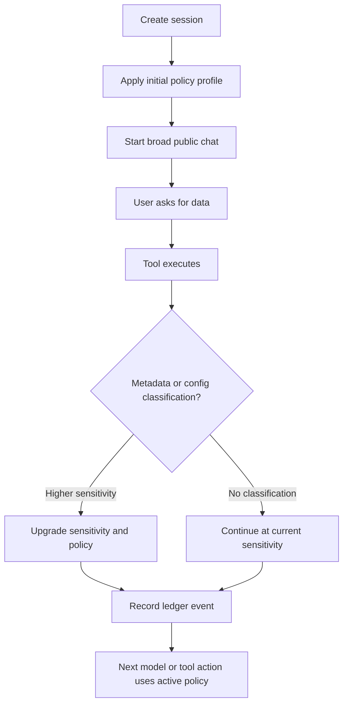

# Governed sessions for the Copilot SDK

This article describes the governance layer for governed agent sessions. A governed session can start with a low-sensitivity profile, allow broad interaction, and then tighten models, tools, providers, and resources when trusted tool or MCP results return classified data.

## Summary

Organizations that standardize on the GitHub Copilot SDK need a consistent way to govern agent behavior across applications. Regulated industries need controls such as data residency and approved model endpoints, but the broader value is standardization: application teams can use the same policy profiles instead of recreating model, tool, resource, and audit controls in every SDK integration.

The SDK layer governs session configuration and SDK-observable execution. It does not, by itself, prove that the surrounding environment, network, identity plane, storage system, or model provider enforces the same policy. Strong compliance guarantees require a guarded deployment environment in addition to SDK policy.

## Goals

- Provide named SDK policy profiles for session governance.
- Restrict models, providers, tools, MCP servers, resources, persistence, and session capabilities by policy when a profile declares restrictions.
- Allow an application or user to set the initial session sensitivity.
- Allow trusted tools to return classification metadata with tool results.
- Automatically upgrade session sensitivity when more sensitive data enters the session.
- Forbid sensitivity downgrades within the same session.
- Emit policy-relevant events that can be consumed by an evidence ledger or observability pipeline.

## Non-goals

- The SDK does not claim full geo-boundary or regulatory compliance by itself.
- The SDK does not replace environment controls such as network egress, endpoint routing, identity, secret access, storage immutability, or provider attestations.
- The first version does not need central enterprise policy distribution.
- Tamper-evident execution history is covered by the separate evidence ledger implementation in this repository.

## Policy profiles

A policy profile is a named configuration that defines what a session can use at a given sensitivity level. Profiles do not have to restrict every dimension. Omitting `models`, `tools`, or another allow/deny list means that profile does not restrict that dimension.

This is important for public or low-sensitivity sessions. A public session can start broadly, including access to tools or MCP servers that may retrieve more sensitive data. The policy layer should not force the application to know the data sensitivity before retrieval. Instead, trusted tools can classify their results, and the session upgrades when sensitive data enters the conversation.

When a profile does declare restrictions, it compiles into concrete session options such as model selection, provider configuration, tool filters, MCP server configuration, persistence settings, and permission behavior.

Policy profiles can control:

- Allowed and denied models.
- Allowed and denied providers.
- Allowed regions or endpoint classes.
- Allowed and denied built-in tools.
- Allowed and denied MCP and custom tools.
- Allowed MCP servers and resources.
- Memory, persistence, telemetry, and session filesystem behavior.
- Model switching behavior.
- Permission behavior.
- Evidence requirements for integrations with an evidence ledger.

```ts
const client = new CopilotClient({
  mode: "empty",
  policies: {
    public: {
      // No model or tool filters: start broad.
    },
    "confidential-eu": {
      models: {
        allow: ["foundry-gpt-4.1-eu", "mistral-large-eu"],
      },
      providers: {
        allow: ["foundry-eu", "mistral-eu"],
      },
      regions: ["eu"],
      tools: {
        allow: new ToolSet().addBuiltIn(BuiltInTools.Isolated),
        deny: new ToolSet().addMcp("*"),
      },
      persistence: "in-memory",
      modelSwitching: "deny-outside-policy",
      evidence: "required",
    },
  },
});
```

## Governed sessions

A governed session is created under a policy profile and an initial sensitivity. The initial profile can be permissive.

```ts
const session = await client.createSession({
  policyProfile: "public",
  sensitivity: "public",
});
```

The governance wrapper resolves the policy profile into concrete session options and rejects conflicting configuration. Deny rules take precedence over allow rules. If a session cannot satisfy the requested policy, the wrapper fails closed instead of weakening the policy.

The implementation validates the selected session model during create and validates runtime model changes before recording them. Stronger enforcement for Auto model routing, fallback models, and sub-agent model selection requires runtime support so the policy can be applied before each model call.

## Classification metadata

Trusted tools and MCP servers can return classification metadata with tool results. The metadata describes the sensitivity of the returned data without requiring the evidence ledger to store the data itself.

```ts
return {
  content: [{ type: "text", text: "Result text..." }],
  _meta: {
    governance: {
      sensitivity: "confidential",
      source: "crm",
    },
  },
};
```

Tool classifications must be trusted according to policy. A policy can treat classification from trusted enterprise tools as authoritative, treat inferred classification as advisory, and deny or raise sensitivity when classification is missing.

## Sensitivity upgrade scenarios

The governed chat sample supports several ways to classify tool results. They have different trust properties, so applications should prefer structured metadata or an explicit configuration mapping over text inferred from a model response.

### A tool returns classification metadata

An MCP tool can place a classification in its result metadata. In the sample, the internal sales tool returns metadata in this shape:

```json
{
  "_meta": {
    "governance": {
      "sensitivity": "internal",
      "source": "governed-chat-sample"
    }
  }
}
```

The governance layer reads the metadata from `tool.execution_complete`. If the returned sensitivity is higher than the active session sensitivity, it upgrades the session before the next model turn. A confidential sales request uses the same shape with `"sensitivity": "confidential"`.

### A tool is classified in configuration

Some tools cannot be changed to add metadata. The application can classify those tools in policy configuration instead:

```json
{
  "toolSensitivity": {
    "mcp:internal-docs-get_internal_demo_data": "internal",
    "mcp:internal-docs-get_confidential_demo_data": "confidential"
  }
}
```

The key is the normalized tool identifier. The configuration mapping is used only when the tool result does not provide an explicit classification. This lets an application govern third-party tools without modifying their implementation. Do not add WorkIQ to this map unless the organization has decided that every result from that tool has the same classification.

### Internal and confidential sales data

The sample exposes one sales-data tool with an explicit sensitivity argument:

```text
get_sales_data({ "sensitivity": "internal" })
get_sales_data({ "sensitivity": "confidential" })
```

The internal result contains non-public operational sales information. The confidential result contains customer and revenue information with a higher disclosure risk. Each result includes both a human-readable classification and governance metadata. The metadata drives the upgrade; the text helps the model and people understand the handling requirement.

### A WorkIQ result contains an explicit label

WorkIQ can return information with different classifications, so the sample does not classify every WorkIQ result automatically. For example, a mail result might contain this subject:

```text
Subject: Internal: This is an internal mail dont use external
```

The sample recognizes the direct `Internal:` marker in the completed tool result and upgrades a public session to `internal`. A result containing `Confidential:` upgrades to `confidential`. An unlabeled WorkIQ result remains at the current session sensitivity.

This is a content marker, not proof that WorkIQ supplied trusted structured metadata. Production integrations should prefer a machine-readable classification from the source system, such as `_meta.governance.sensitivity`, and record the source of the label in the evidence ledger.

### Model judgment is not a classification authority

The model can explain that a result appears sensitive, but the current governance layer does not treat an ordinary assistant statement as an authoritative upgrade signal. A future integration can expose a governed `request_sensitivity_upgrade` tool, but that tool must only request an upgrade: it must validate the requested level, apply the monotonic policy, and reject downgrade requests. The model must never be able to lower the active sensitivity.

The current safe order of preference is:

1. Use trusted structured metadata from the tool or source system.
1. Use an explicit `toolSensitivity` mapping for tools that cannot return metadata.
1. Use a clearly defined content marker only when the integration cannot provide structured metadata.
1. Treat model-only judgments as advisory until a governed upgrade interface validates them.

## Monotonic sensitivity

Session sensitivity can only increase during a session. Downgrades are forbidden because prior context, summaries, tool results, citations, memory, or model-visible state may still contain higher-sensitivity information. Returning to a lower sensitivity requires a new session or another explicit isolation boundary, not a downgrade of the existing session.

```text
public < internal < confidential < restricted
```

If a tool returns confidential data during a public or internal session, the wrapper upgrades the active session policy before the next model call. The upgraded profile can then restrict model selection, tool use, MCP servers, persistence, telemetry, or other session capabilities. If the accumulated classification labels cannot be satisfied by any approved model, provider, or tool configuration, the wrapper fails closed.

This creates the intended flow:

1. Start a session as `public`.
1. Allow the user to ask for data without knowing its sensitivity in advance.
1. Let a trusted tool or MCP server return result classification metadata.
1. Upgrade the active profile when higher-sensitivity data enters the session.
1. Apply stricter model, tool, provider, persistence, and evidence requirements for all later work.
1. Never downgrade the session.

The active sensitivity and highest-ever sensitivity must be persisted with resumable sessions. A resumed session cannot restart under a weaker policy. The application must create a new session to return to a lower sensitivity boundary.

## Relationship to the evidence ledger

Governed sessions and the evidence ledger are separate features that compose well.

Governed sessions decide what a session can do. They emit policy-relevant events when a policy is applied, a tool is denied, a model is selected, or sensitivity is upgraded. The evidence ledger records those events in an append-only, hash-chained execution history.

The policy feature does not require a ledger for all uses. Some applications need policy enforcement without durable audit evidence. Other applications need execution evidence even when they use custom application-level policy.

## SDK surface

```ts
const governed = await GovernedSession.create({
  client,
  policy: {
    profiles,
    toolSensitivity: {
      "mcp:internal-docs-get_internal_demo_data": "internal",
      "mcp:internal-docs-get_confidential_demo_data": "confidential",
    },
  },
  profile: "public",
  ledger: new LocalJsonlLedger(ledgerPath),
});
```

```ts
interface GovernanceProfile {
  name: string;
  sensitivity: "public" | "internal" | "confidential" | "restricted";
  model?: string;
  allowedModels?: string[];
  deniedModels?: string[];
  tools?: string[];
  deniedTools?: string[];
}

interface GovernancePolicy {
  profiles: Record<string, GovernanceProfile>;
  toolSensitivity?: Record<string, GovernanceProfile["sensitivity"]>;
}
```

## Execution flow



## Implementation boundaries

The governance wrapper can enforce SDK-observable model and tool decisions and record evidence. It cannot by itself prove that a provider, external MCP server, identity system, network, storage system, or administrator configuration enforces the same policy. Stronger guarantees require controls at those integration points.
